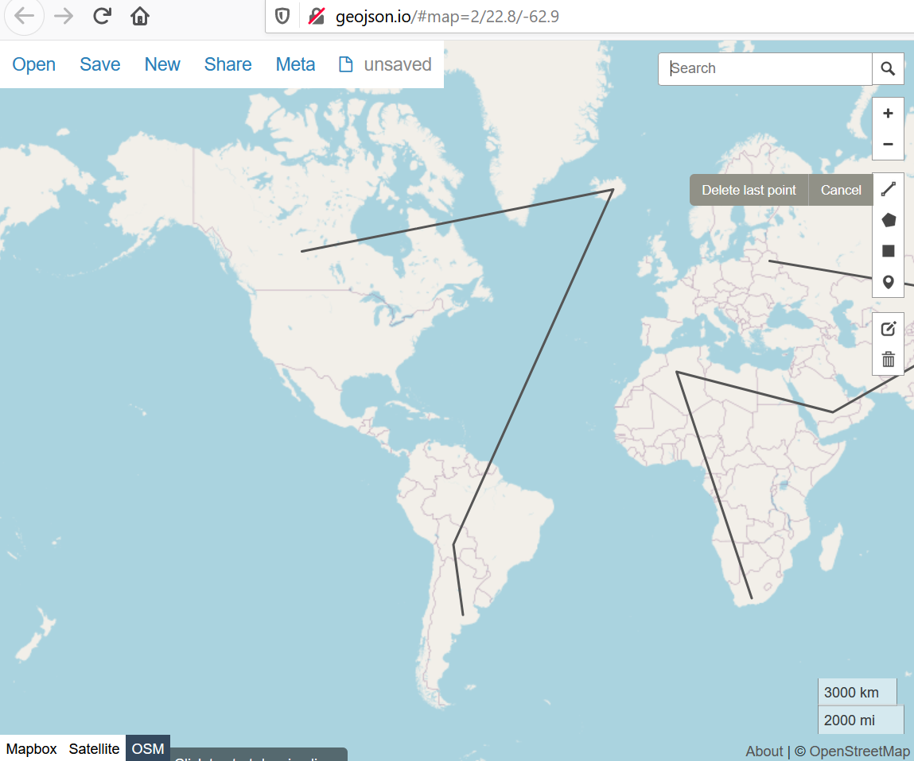

# Erstellen und Bearbeiten von GeoJSON Dateien mit Geojson.io

Für viele Geisteswissenschaftler/Innen und Mitarbeiter/Innen in der Forschungskommunikation sind Karten attraktive Werkzeuge, um räumliche Beziehungen und Entwicklungen verständlich zu machen. Allerdings fällt es oft schwer, geeignete Werkzeuge zur Kartenerstellung auszuwählen, da die Möglichkeiten klassischer Einsteigertools wie Palladio und Dariah-De Geobrowser besonders im Bereich des Exports hochwertiger Kartenbilder sehr beschränkt sind, während viele andere Werkzeuge aufwendigere Softwareinstallationen, Kenntnisse in der Arbeit mit Terminal / Kommandozeile oder sogar Erfahrung mit Programmiersprachen erfordern.

In diesem Tutorial möchte ich deshalb eine einfache Methode der Aufbereitung geographischer Informationen mit [Geojson.io](http://geojson.io/#map=2/20.0/0.0) vorstellen. Geojson.io ist ein browsergestütztes Tool, das keine Installationen erfordert und die Erstellung von sog. GeoJSON-Dateien ermöglicht, die von allen gängigen GIS-Tools gelesen und in Karten verarbeitet werden können.

Anstatt Tabellen in Excel anzulegen, die dann mithilfe zusätzlicher Software geokodiert und exportiert werden müssen, kann man mit Geojson.io Ortsdaten direkt aus einer Karte auswählen, anreichern und in kompatiblen Formaten speichern. 


----

Es wird dringend empfohlen, sich zu registrieren, da dann begonnene Projekte temporär im Profil gespeichert werden können. Außerdem stehen erweiterte Funktionen nur registrierten Nutzer/Innen zur Verfügung. Die Anmeldung kann z.B. über ein bereits vorhandenes Github-Profil erfolgen. Wenn man die Geojson.io-Seite öffnet, erscheint links eine auf Open Street Map beruhende Karte mit Suchfeld, in der man frei navigieren und Marker für verschiedene Geometrien (Punkte, Linien und Polygone) setzen kann. Rechts daneben erscheinen die gewählten Geometrien automatisch im GeoJSON-Format.


----

Um die in Geojson.io erstellten Geoinformationen um weitere Attribute wie z.B. Namen oder Datumsangaben zu erweitern, kann man in der geschweiften "properties" Klammer der GeoJSON-Datei beliebig viele "key-value-pairs", also Paare aus "Schlüssel" und "Wert" eintragen.

So wie in der „geometry“-Klammer der GeoJSON-Datei automatisch ```"type":"Point"``` erscheint, wenn ein Punkt auf der Karte markiert wird, so kann unter "properties" z.B. ```"label":"IEG Mainz"``` eingetragen werden. Es ist hier auch möglich, mehrere Informationen miteinander zu verbinden und Satzzeichen zu verwenden, sofern diese in Anführungszeichen geschrieben werden:

```"label":"2020: IEG, Mainz"```

Wenn diese Information auf mehrere Attribute verteilt wird, ist es allerdings leichter, die Punkte auf der Karte später nach diesen Attributen kategorisiert zu kolorieren oder anderweitig hervorzuheben. So könnte die oben angegebene Information auf ein Anzeigelabel (```"label":"2020: IEG, Mainz"```) und die Selektionskriterien ```"date":"2020"``` und ```"place":"Mainz"``` aufgeteilt werden. Die Bezeichnung der "properties"-Schlüssel ist dabei frei wählbar. Leerzeichen nach den Doppelpunkten und Zeilenumbrüche dienen der besseren Lesbarkeit. 


----

Ein besonders nutzerfreundliches Attributmanagement erschließt sich durch einen Doppelklick auf eine einzelne Geometrie in der Karte. Ein kleiner Kasten mit den bestehenden "Properties" erscheint, der über ```"add row"``` um neue Attribute analog zu den "key-value-pairs" erweitert werden kann. Außerdem ist es hier möglich, die Anzeigefarbe der Geometrien in ```"marker-color"``` zu ändern und so z.B. Punkte zu markieren, die bereits bearbeitet wurden oder zu einem späteren Zeitpunkt geprüft werden müssen. Besonders hilfreich ist diese Funktion auch, wenn Geometrien von Nord nach Süd oder von West nach Ost fortlaufend nummeriert werden sollen. Da die Anordnung der Punkte auf der Karte nicht der Reihenfolge der "features" in der GeoJSON-Datei entsprechen muss, behält man hier leichter den Überblick.

Alle Eintragungen in der Code-Ansicht (</> im Bedienfeld oben) oder in den Attributboxen können abschließend in der Tabellenansicht von Geojson.io überprüft und ergänzt werden.


----


----

Außerdem ist es möglich, anstatt der (modernen) politischen Karte als Hintergrund auch das Satellitenbild oder die (unbeschriftete) OSM Standardkarte zu wählen.



----


----

Nach jedem wesentlichen Arbeitsschritt sollte das File gespeichert bzw. exportiert werden ("save" Option). Für die weitere Bearbeitung und Visualisierung der Geodaten in einem GIS-Werkzeug wie QGIS oder Mapbox ist es erforderlich, die Daten nicht etwa als CSV-Tabelle, sondern als GeoJSON-Datei zu sichern. Wie die Daten in ein GIS-Werkzeug importiert und bearbeitet werden, erkläre ich einem weiteren Blogpost [XY](Link).

Eine ausführlichere Einführung in Geojson.io gibt das folgende Video-Tutorial von Riccardo Klinger (in englischer Sprache):

["GeoJSON.io editing webmap data online"](https://www.youtube.com/watch?v=sPAkG7bS10o)

<iframe width="500" height="281" src="https://www.youtube.com/embed/sPAkG7bS10o" frameborder="0" allow="accelerometer; autoplay; encrypted-media; gyroscope; picture-in-picture" allowfullscreen></iframe>

Außerdem empfehle ich das auf Geoinformationssysteme spezialisierte Forum [GIS.Stackexchange](https://gis.stackexchange.com/).
