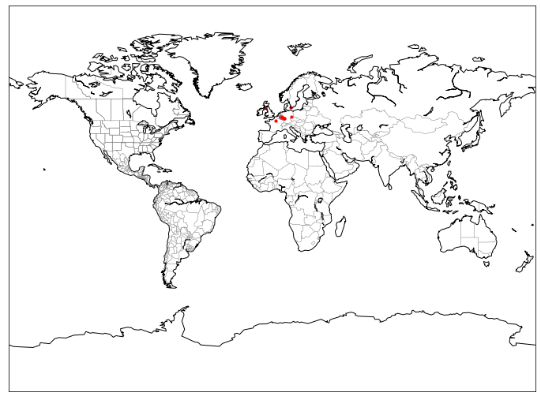
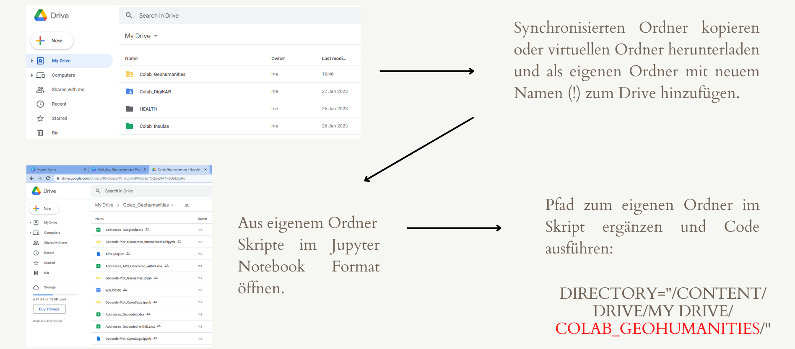
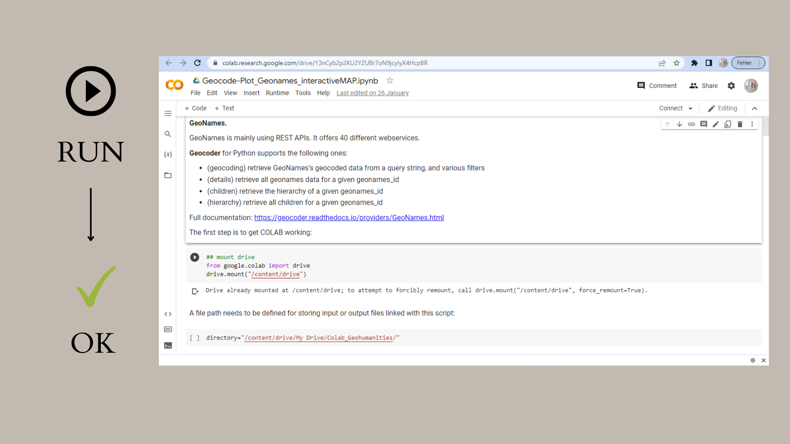

<h2>Geocoding with the Geonames API in Python</h2>

This tutorial is an interactive tutorial that combines actual executable code with explanations in a Google Colab notebook. As the tutorial makes use of my own Geonames API key,
I will only grant access to selected users.

The Python code (in Jupyter Notebooks format) with in-line comments is available in the  directory. Executing this code in a suitable environment should first show you the content of the input file, which only has a single column of twelve place names in my sample. Then the code should geocode your address column with Geonames, add the Geonames ids and official Geonames place descriptions,
and append all the new information to the existing table.

In the last step, all places which could be geocoded will be plotted as small dots on a simple world map:

This is not the ideal display to check the geocoding
of individual cities, which is why I have provided 

While it is also possible to geocode data with software such as <a href="https://www.qgis.org/en/site/">QGIS</a>, capturing additional information such as Geonames (and Wikidata) IDs can be important for making data interoperable and reusable. Working with Python offers many opportunities for enriching the collected data.

To run the code using your own files, you can run the script on your own machine, on a Jupyter Notebook server, or on Google Colab. The advantage of Google Colab is that you can run the script as it is -- without installing Python packages first. In all cases, you have to make sure, however, to adjust the file path / directory. Whenever you upload files to your Google Drive on the top level, the standard path is "/content/drive/My Drive/". Any subfolders you create will have to be added as "/content/drive/My Drive/YourFolder/". Please make sure to change all instances of file paths in scripts you download from Github. Similarly, participants of my workshops who have direct access to one of my Google Drive Colabs should copy that folder to create their own instance also change file paths where necessary.

  

This German screenshot summarises the workflow for copying a shared Colab folder to your own Drive:

  

  

Also, each section of code has to be run one after the other. A green arrow on the left hand side indicates if a section of code has been executed correctly. Please see the instructions in the screenshorts below.

