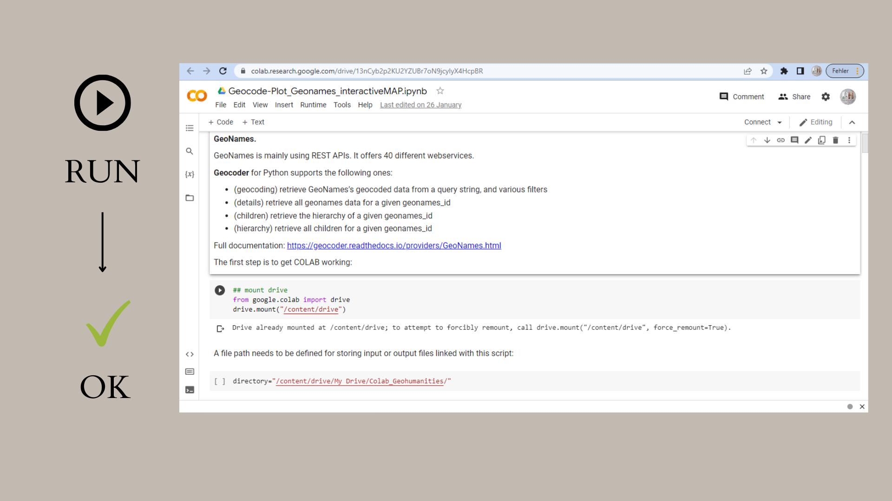

<h2>Google Colab tutorial for geocoding EXCEL spreadsheets with OpenCage in Python</h2>

This Google Colab tutorial was written for a workshop for colleagues in early modern history and demonstrates geocoding with the proprietary OpenCage API. Colab is a cloud service that permits the hosting of Jupyter notebooks for running Python code even when users do not have Python installed on their own machines. Also, it is possible to run different sections of code separately and to add free text instructions for less experienced users. One advantage of Google Colab in research and teaching is that teams can interactively and iteratively process and review data. In my case, the input data come from EXCEL spreadsheets, which are still commonly used in smaller projects as databases are difficult to maintain.

Sample input data, my annotated code and a sample map can be viewed in my  directory. Access to the  is restricted is the script makes use of my personal API key.

My test Colab notebook uses the proprietary <a href="https://opencagedata.com/api">OpenCage API</a> which only permits users with trial accounts a few thousand spatial queries per day. My test notebook lots the geocoded data directly to a static map just to help users double-check the locations. Potentially, geocoding with different APIs should be tested and compared especially when working with historical data. This is why I recommend testing my scripts for geocoding with the Geonames and Google APIs as well.

To run the code using your own files, you can run the script on your own machine, on a Jupyter Notebook server, or on Google Colab. The advantage of Google Colab is that you can run the script as it is -- without installing Python packages first. In all cases, you have to make sure, however, to adjust the file path / directory. Whenever you upload files to your Google Drive on the top level, the standard path is "/content/drive/My Drive/". Any subfolders you create will have to be added as "/content/drive/My Drive/YourFolder/". Please make sure to change all instances of file paths in scripts you download from Github. Similarly, participants of my workshops who have direct access to one of my Google Drive Colabs should copy that folder to create their own instance also change file paths where necessary.

  

This German screenshot summarises the workflow for copying a shared Colab folder to your own Drive:

  

  

Also, each section of code has to be run one after the other. A green arrow on the left hand side indicates if a section of code has been executed correctly. Please see the instructions in the screenshorts below.

