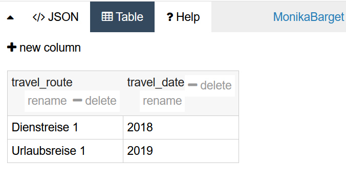

# Creating and Editing GeoJSON Files with Geojson.io

For many humanities scholars and research communicators, maps are appealing tools to make spatial relationships and developments more comprehensible. However, it is often difficult to choose the right mapping tools. Beginner options like Palladio or the Dariah-DE Geobrowser are limited, especially when it comes to exporting high-quality map images. Many more powerful tools require complex software installations, command line work, or programming skills.

This tutorial introduces an easy way to prepare geographic data using <a href="http://geojson.io/#map=2/20.0/0.0">Geojson.io</a>. Geojson.io is a browser-based tool that requires no installation and allows users to create GeoJSON files that can be read and processed by all major GIS platforms.

Instead of creating tables in Excel that must be geocoded and exported using additional tools, Geojson.io allows you to select, enrich, and save location data directly from a map in compatible formats.

  

----

It is highly recommended to register a user account, so that unfinished projects can be temporarily saved to your profile. Some advanced features are also only available to registered users. Login can be done using an existing GitHub account. Upon opening Geojson.io, you’ll see a map (based on OpenStreetMap) on the left with a search bar, where you can freely navigate and place markers for points, lines, or polygons. On the right, the geometries are displayed in real time in GeoJSON format.

  

----

To enrich the geoinformation created in Geojson.io with additional attributes such as names or dates, you can add as many "key-value pairs" as needed within the <code>"properties"</code> brackets of the GeoJSON file.

Just like <code>"type":"Point"</code> is automatically generated under the <code>"geometry"</code> bracket when placing a point, you could add <code>"label":"IEG Mainz"</code> under <code>"properties"</code>. It is also possible to include punctuation and combine multiple pieces of information in quotes: <code>"label":"2020: IEG, Mainz"</code>.

However, it is often more effective to split complex labels into separate attributes. For example: <code>"label":"2020: IEG, Mainz"</code>, <code>"date":"2020"</code>, <code>"place":"Mainz"</code>. Attribute names are freely definable. Spaces and line breaks improve readability.

  

----

Attribute management becomes especially user-friendly when you double-click on a geometry on the map. A small box opens showing the current properties, and new key-value pairs can be added via <code>"add row"</code>. Here, you can also adjust the display color using <code>"marker-color"</code>, for example to highlight edited or to-be-reviewed points. This is especially useful when points are numbered spatially (e.g., from north to south), which may not match the feature order in the code view.

  

----

  

----

You can also switch the basemap in Geojson.io, choosing a satellite image or an unlabelled OSM standard map instead of the default political map.

  

----

  

----

After each major step, your file should be saved or exported (using the “save” option). To edit or visualise your geodata in GIS tools like QGIS or Mapbox, be sure to export it as a GeoJSON file—not as a CSV table.

How to import and edit this data in QGIS is explained in a separate post: [XY](Link).

A helpful English-language video introduction is this tutorial by Riccardo Klinger:

<a href="https://www.youtube.com/watch?v=sPAkG7bS10o">"GeoJSON.io editing webmap data online"</a>

<iframe width="500" height="281" src="https://www.youtube.com/embed/sPAkG7bS10o" frameborder="0" allow="accelerometer; autoplay; encrypted-media; gyroscope; picture-in-picture" allowfullscreen></iframe>

For further support, you can browse or ask questions on the GIS community forum <a href="https://gis.stackexchange.com/">GIS Stack Exchange</a>.

