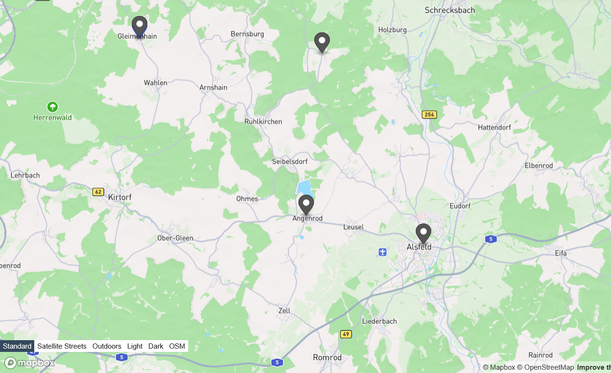

<h2>Drawing the line – cartography, borders and the negotiation of space in a historical perspective</h2>

 
Donald Trump's symbolic gesture of altering geographic names and Russia’s use of historical maps to justify the invasion of Ukraine are contemporary reminders that cartography plays an important role in the creation and contestation of political territories. Far from being neutral representations of geographic space, maps have a long history as tools of power. In our workshop, we will explore several historical examples of how cartography (both hand-drawn and printed) has contributed to the making and unmaking of territorial claims. We will consider the visual and narrative strategies used and reflect on the audiences for whom maps were produced in different contexts. This can help help us critically engage with modern cartographic practices in shaping borders and communicating territorial claims.

 <h3>Case study 1: observational cartography in early modern Germany</h3> 

An interesting cartographic tradition closely tied to legal disputes over borders and territories is the so-called <em>"Augenscheinkarte"</em> (inspection map). In the German-speaking world, where they have been common since the early 16th century, these maps are also referred to as <em>"Streitkarten"</em> (dispute maps). The term refers to a hand-drawn map that depicts topographical circumstances only vaguely after an inspection of the terrain, without a formal land survey.

  In archives, these maps are usually preserved in the context of more extensive legal records, which is why earlier scholarship assumed they were used as legal evidence in their own right. However, more recent research suggests that they were rather supportive illustrations, comprehensible only in conjunction with the textual documents. Moreoever, they were also used outside of court contexts. (Timpener, 2022) A particularly large number of inspection maps from the early modern period survive from regions along the river Rhine, as the Rhine was an important trade route and financial resource. Those controlling certain sections of the Rhine could profit from toll and staple rights. This made claiming Rhine access attractive to all adjacent principalities. Many of the maps created here were artistically ambitious and featured detailed naturalistic elements. (Kümper, 2023, p. 57)

Other inspection maps are highly abstract and focus on just a few key features, such as boundary stones. The map embedded below (<strong>fig. 1.1</strong>) comes from the holdings of the Hessian State Archive in Darmstadt and is a minimalist sketch from the year 1628. It shows the approximate borders of the three villages of Angenroth, Gleimenhain, and Fischbach, as well as their proximity to the territories of Hesse-Darmstadt, Hesse-Kassel, and Electoral Mainz:

<figure>
  
  <figcaption>Figure 1.1: Map HStAD P 1, 2522, used with permission of the Hessian State Archive</figcaption>
</figure>

This map was created by Rentmaster Daniel Ludwig Lüncker in Alsfeld, the nearby town, presumably on behalf of the landgravial government of Hesse-Darmstadt. The map measures 33 by 42 cm and is drawn on paper.

<strong>The original title reads:</strong>

<blockquote>
"Ungefehrer Abriß dardurch nurentgezeiget würd, wie die drei Dorff Angenroht, Gleymenhain sowie Fischbach ... Landgraf Georgen zu Hessen etc. Land und an Kurmainz und einesteils an Hessen-Kassel stoßen."
</blockquote>

Alsfeld, where the map was created, was a significant and often contested trading hub from the Middle Ages into the early modern period. From 1567, Alsfeld was part of Hesse-Marburg and from 1604 of the Landgraviate of Hesse-Darmstadt. During the Hessian War (1645–1648), Alsfeld lay on the border between the warring factions of Hesse-Darmstadt and Hesse-Kassel. This conflict, part of a long series of diplomatic and military struggles between the branches of the Hessian princely house, originated in the division of inheritance after the death of the last united Landgrave of Hesse, Philip I, in 1567.

By modern standards, Alsfeld is a comparatively small town, and the surrounding villages have all been integrated into larger administrative units. The map in <strong>fig. 1.2</strong> highlights Alsfeld, Angenroth, Gleimenhain and Fischbach in a considerably rural area of present-day Germany:

<figure>
  
  <figcaption>Figure 1.2.: Modern map of the Alsfeld region, created with Geojson.io by Monika Barget</figcaption>
</figure>

For critical comparison, you may also want to look at a printed map of the same region produced in the later 17th-century (<strong>fig. 1.3</strong>).

<figure>
  
  <figcaption>Figure 1.3.: Copper-engraved map by G. C. Jung, 1692, photographed by Antiquariat Bierl</figcaption>
</figure>

This map is a copper engraving created by G. C. Jung from Nuremberg in the year 1692. The dimensions of the map are 14 by 19.5 cm. It is part of a larger, 64-part map series called <em>Franconiae mappa locupletissima</em> (a most richly illustrated map of Franconia).

<h3>Questions for discussion:</h3>
<ul>
  <li>Examine the digitised versions of the two historical maps. What cartographic elements does each of them include and what is "missing"? What does this suggest about the purpose of each map?</li>
  <li>Both maps include text (mostly place and region names) as well as symbols. What do the symbols represent and why are they important?</li>
  <li>What do the maps reveal more generally about spatial understanding and territorial belonging at the time of their creation? Which aspects are still relevant today, and what may have changed?</li>
</ul>

<h3>Works cited:</h3>
<ul>
  <li>
Kümper, H. (2023). Streit um den Rhein: von Zöllen, Sand und ganz viel Ärger. Gedächtnis der Rheinschifffahrt, 1(1), 51–70. 
    <a href="[https://majournals.bib.uni-mannheim.de/download](https://majournals.bib.uni-mannheim.de/index.php/gdr/article/view/222 )" target="_blank">https://majournals.bib.uni-mannheim.de/index.php/gdr/article/view/222</a>
  </li>
  <li>
    Timpener, E. (2022) From Inspection to Map: The Relationship between Text and Image. In: <em>Augenschein genommen: Hessische Lokal- und Regionalkartographie in Text und Bild (1500–1575)</em>, Berlin, Boston: De Gruyter Oldenbourg, 68–124. 
    <a href="https://doi.org/10.1515/9783110777598-004" target="_blank">https://doi.org/10.1515/9783110777598-004</a>
  </li>
</ul>

<h2>Case study 2: Indigenous cartography and European conventions</h2>

The creation of maps is closely linked to the territorialisation of power that marked the early modern period in Europe (Barget, 2023), but this does not mean that visualisations of space were absent from other cultures before the age of colonialism. Indigenous peoples across the world have named and visually recorded places in their own ways, and contact with European culture often meant that traditional concepts of space and colonial demarcations of territory influenced each other.

It takes training and deliberate distancing from our modern cartographic conventions, however, to understand and appreciate Indigenous geovisualisations:

<blockquote>
"In Indigenous sciences, the world is often understood in terms of flows of energies (and sometimes entities) across a permeable boundary between manifest and unmanifest realities. Working relationships with forces deemed 'superstitious' or 'irrational' in modern science are significant aspects of social processes and healing practices. Maintaining these worldviews and practices is an uphill battle against the hegemony of modern scientific thought and the legacy of missionaries and educators who tried so hard to dismantle Indigenous knowledge systems." (Herman, 2008, p. 75)
</blockquote>

Today, Indigenous communities are actively remapping and renaming their homelands to assert their presence on the land, and preserve their languages and stories. In this process, maps play an important role, but many of the modern maps dedicated to Indigenous cultures still follow modern Western conventions of map-making. The <em>Indigenous Peoples Atlas of Canada</em>, for example, shows new perspectives on the history and geography of Canada in maps produced with standard Geoinformation Systems, including common spatial projections and keys (<strong>fig. 2.1</strong>).

<figure>
  
  <figcaption>Figure 2.1: Map of Inuit-owned lands in Nunavut, 2016, Indigenous Peoples Atlas of Canada</figcaption>
</figure>

Older maps created by Indigenous artists, by contrast, were more visibly inspired by traditional iconography and unique experiences of space (Hidalgo, 2019). The map in <strong>fig. 2.2</strong> is one example. It was created by an unknown artist from Tetliztaca, Mexico, in around 1581. It is held by the Benson Latin American Collection at the University of Texas, Austin:

<figcaption style="clear: both; text-align: center; display: block;">Figure 2.2: Tetliztaca Map, ca. 1581, Beson Latin American Collection, University of Texas</figcaption>

In 2019, the Blanton Museum of Art at the University of Texas exhibited this map alongside eighteen other hand-painted Indigenous maps, collectively known as the "Mapas de las Relaciones Geográficas", in their exhibition “Mapping Memory: Space and History in 16th-century Mexico”.

<h3>Questions for discussion:</h3>
<ul>
  <li>Look at the visual elements used in the map and try to describe them. In what categories do the different elements fall? What distinguishes them from modern-day maps? What do the visual markers tell us about the Indigenous relationship with space? Which elements are distinctly colonial and where do you observe boundaries between spheres?</li>
  <li>Monica Uszerowicz recounts in her article about the "Mapping Memory" exhibition that the hybrid style of the "Mapas" challenges the idea that Indigenous cultures were completely destroyed by the Spanish invasion (Uszerowicz, 2019). Can you think of other examples where geography and cartography combine elements from different cultures and help to preserve traditional knowledge?</li>
  <li>What is special about maps as compared to other media that preserve cultural knowledge? For what type of knowledge or what (political) circumstances are maps especially useful?</li>
  <li>Indigenous maps, like maps generally, also point to social hierarchies within a community as the ability to draw and represent knowledge about space is linked with education and status. Similarly, owning and reading maps requires financial resources and skills. The Mexican Indigenous maps were mostly made by elites, and Mestiza culture also played an important role. Does highlighting geographic and cartographic production deflect our attention too much from everyday lives of the lower classes? What place should elite production generally have in the context of postcolonial and de-colonial discourse?</li>
</ul>

<h2>Works cited:</h2>
<ul>
<li>Barget, M. (2023). Raumwissen konstruieren, konservieren und kommunizieren. Geographie und Kartographie im Europa der Frühen Neuzeit. In Wissen ordnen und entgrenzen? Vom analogen zum digitalen Europa? Vol. Band 141 (pp. 67–86). Vandenhoeck & Ruprecht. https://doi.org/10.13109/9783666302312.67</li>
  <li>Herman, R. (2008). Reflections on the importance of Indigenous geography. <em>American Indian Culture and Research Journal, 32</em>(3), 73–88. https://doi.org/10.17953/aicr.32.3.n301616057133485</li>
  <li>Hidalgo, A. (2019). <em>Trail of footprints: A history of Indigenous maps from Viceregal Mexico</em>. University of Texas Press.</li>
  <li>Indigenous Peoples Atlas of Canada. (2025). https://indigenouspeoplesatlasofcanada.ca/. Accessed 12 May 2025.</li>
  <li>loprespub. (2021). Putting Indigenous perspectives on the map: Indigenous mapping and place names. <em>HillNotes</em>. https://hillnotes.ca/2021/06/21/putting-indigenous-perspectives-on-the-map-indigenous-mapping-and-place-names/</li>
  <li>Uszerowicz, M. (2019). Indigenous artists used maps as tools of resistance in colonial Mexico. <em>Artsy</em>. https://www.artsy.net/article/artsy-editorial-indigenous-artists-maps-tools-resistance-colonial-mexico</li>
</ul>

<h2>Case study 3: Maps as weapons? The 2023 Chinese "standard map" controversy</h2>

In 2023, China released an updated map during their annual “National Mapping Awareness Publicity Week.” This map, hosted on the Ministry of Natural Resources’ cartographic service website, extends territorial claims along China’s western border with India, the South China Sea, and Taiwan. The inclusion of a purple dashed line around the South China Sea and Taiwan further complicates maritime disputes. The Philippines, Malaysia, Taiwan, India, and Vietnam have rejected the map, and international news services as well as NGOs have discussed the geopolitical strategy behind it.

Simone McCarthy (2023), writing for CNN, discussed controversies about Chinese maps more generally and mentioned that a recent digital map used by Chinese web-services missed the country name Israel while the Gaza conflict is ongoing. In general, China is known to pay careful attention to their map production but also monitor how their territories are depicted abroad. M. Respinti (Bitter Winter) pointed out that manipulations of geography have real-life implications for human beings and should not be taken lightly:

<blockquote>
"The distortions and the far-reaching implications that those maps carry within the broader geopolitical and human landscapes make the topic extremely sensitive." (Respinti, 2024)
</blockquote>

Similar concerns were voiced by B. Sebastian (Modern Diplomacy) and the editing team behind <em>Investigative Journalism Reportika</em>. Meanwhile, Oiwan Lam, a regional editor at <em>Global Voices</em> for Northeast Asia and media activist based in Hong Kong, pointed out that the 2023 standard map of China contained "nothing new":

<blockquote>
"The map is consistent with China's previous claims, which have extended its jurisdiction over disputed areas along India and Russia's borders and in the South China Sea." (Lam, 2023)
</blockquote>

So why did so many countries protest more vocally then ever before? According to Lam, what has changed is not the map, but its context:

<blockquote>
"China has become more aggressive in establishing its military presence around the Paracel Islands near Vietnam’s exclusive economic zone (EEZ), Scarborough Shoal and Spratly Islands near the Philippines EEZ through military drills, the construction of artificial islands and permanent facilities and deployment of large vessels to patrol in the disputed area in the past two decades. The aim is to control fishing operations, oil and gas exploration activities, and seabed internet cable-laying operations."
</blockquote>

The map displayed here (<strong>fig. 3.1</strong>) is a screenshot of the new Chinese map shared by Oiwan Lam in her blog post. The screenshot focuses on the above-mentioned lines in the South China Sea that demonstrate China's claims over the entire region. The screenshot was taken from the Chinese government standard map service website, which is, unfortunately, not accessible from all IP addresses.

<figcaption style="clear: both; text-align: center; display: block;">Figure 3.1: Chinese Standard Map, 2023, published by the Ministry of Natural Resources, screenshot by Oiwan Lam</figcaption>

Official English-language information by the Chinese government on this map, including a Chinese-language screenshot, is shared <a href="https://www.chinadaily.com.cn/a/202308/28/WS64ec91c2a31035260b81ea5b.html" target="_blank">here</a>, but the screenshot provided is not zoomable and too small to read.

<h3>Questions for discussion:</h3>
<ul>
  <li>Look at Oiwan Lam's English-language screenshot of the 2023 map and discuss the different types of borders shown in the legend. Apart from a national boundary, we see boundaries for provinces, regions or municipalities under control of the central government, as well as so-called <a href="https://en.wikipedia.org/wiki/Banners_of_Inner_Mongolia">"banner"</a> boundaries (内蒙古自治区旗界, translated to "regional" in the screenshot) exclusive to the Inner Mongolia Autonomous Region. The legend also includes a dotted "military demarcation line". What roles do these different boundaries most likely play in China's administration and international relations? </li>
  <li>Why is it necessary for the Chinese government to regularly issue a new "standard map"? Which other countries do this and why? Can you name other conflicts that have recently arisen from this practice?</li>
  <li>In what contexts do you consult official government-issued maps for specific countries rather than Google maps or similar (US-based) web-mapping services? What are the (dis)advantages?</li>
  <li>Oiwan Lam points that all maps have context. What can be done to raise awareness for the contextuality and, therefore, lack in neutrality in the general public?</li>
</ul>

<h2>Works cited:</h2>
<ul>
  <li>Lam, O. (2023). The Chinese 2023 map has nothing new. But why are China’s neighbours mad about it? <em>Global Voices</em>. https://globalvoices.org/2023/09/05/the-chinese-2023-map-has-nothing-new-but-why-are-chinas-neighbours-mad-about-it/</li>
  <li>McCarthy, S. (2023). As Gaza conflict rages, online maps from Chinese companies are missing Israel’s name. <em>CNN</em>. https://edition.cnn.com/2023/11/02/china/china-maps-baidu-amap-israel-intl-hnk</li>
  <li>Respinti, M. (2024). The CCP’s weaponization of geographical maps. <em>Bitter Winter</em>. https://bitterwinter.org/the-ccps-weaponization-of-geographical-maps/</li>
  <li>Sebastian, B. (2023). China’s updated map and the undoing of diplomacy. <em>Modern Diplomacy</em>. https://moderndiplomacy.eu/2023/08/30/chinas-updated-map-and-the-undoing-of-diplomacy/</li>
</ul>

<h2>Recommended book on "maps that made history"</h2>

If you would like to learn more about "maps that made history" and the people behind them, Martijn Storms' <em>Kaarten die geschiedenis schreven: 1000 jaar wereldgeschiedenis in 100 oude kaarten<em> is a well-illustrated starting point. Spanning a millennium, this 432-page hardcover volume presents 100 selected historical maps from a 12th-century Persian world atlas to a 2013 Chinese government map. The maps, sourced from the collections of Leiden University Libraries, are reproduced in high quality.

Storms, M. (2022). Kaarten die geschiedenis schreven: 1000 jaar wereldgeschiedenis in 100 oude kaarten. Lannoo. ISBN 9789401485296.
