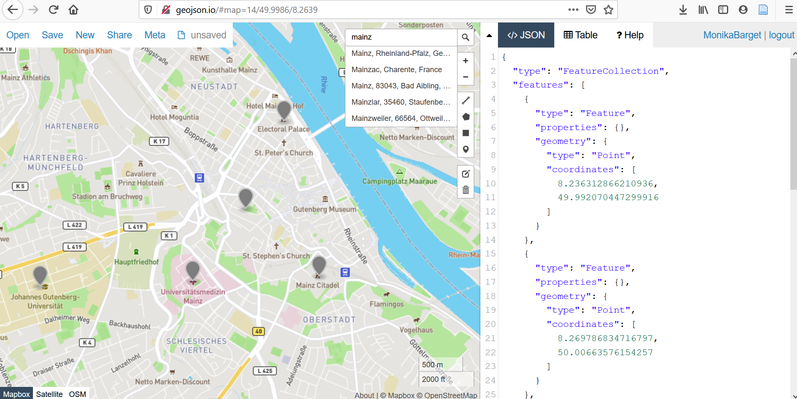
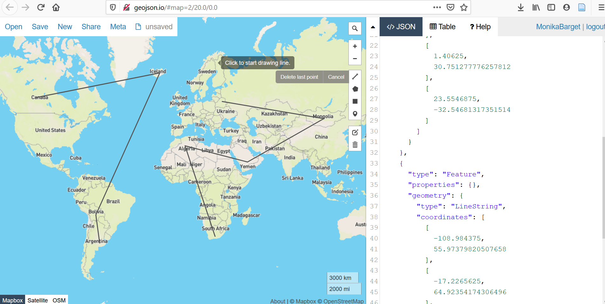

# GeoJSON-bestanden maken en bewerken met Geojson.io

## Geojson.io als gebruiksvriendelijke tool voor beginners

Voor veel geesteswetenschappers en medewerkers in de wetenschapscommunicatie zijn kaarten aantrekkelijke hulpmiddelen om ruimtelijke relaties en ontwikkelingen inzichtelijk te maken. Het is echter vaak lastig om het juiste kaartgereedschap te kiezen. Instapopties zoals Palladio of de Dariah-DE Geobrowser zijn beperkt, vooral als het gaat om het exporteren van kaarten in hoge resolutie. Geavanceerdere tools vereisen vaak complexe software-installaties, het gebruik van de opdrachtregel of programmeervaardigheden.

In deze tutorial stellen we een eenvoudige methode voor om geografische gegevens te bewerken met <a href="http://geojson.io/#map=2/20.0/0.0">Geojson.io</a>. Geojson.io is een browsergebaseerde tool die geen installatie vereist en gebruikers in staat stelt GeoJSON-bestanden te maken die door alle gangbare GIS-platforms gelezen en verwerkt kunnen worden.

In plaats van tabellen te maken in Excel die vervolgens moeten worden geogecodeerd en geëxporteerd met extra software, kun je met Geojson.io locaties direct op een kaart selecteren, verrijken en opslaan in compatibele formaten.

  

## Handmatig geometrieën toevoegen

Het is sterk aan te raden om een gebruikersaccount aan te maken, zodat niet-afgeronde projecten tijdelijk in je profiel kunnen worden opgeslagen. Sommige geavanceerde functies zijn alleen beschikbaar voor geregistreerde gebruikers. Aanmelden kan bijvoorbeeld via een bestaand GitHub-account. Bij het openen van Geojson.io zie je links een kaart (gebaseerd op OpenStreetMap) met een zoekbalk, waarin je vrij kunt navigeren en markers kunt plaatsen voor punten, lijnen of polygonen. Aan de rechterkant worden de geometrieën in realtime weergegeven in GeoJSON-formaat.

  

## Extra informatie toevoegen in de code-editor

Om de geografische gegevens in Geojson.io aan te vullen met aanvullende attributen, zoals namen of data, kun je binnen de <code>"properties"</code>-haakjes zoveel "key-value pairs" toevoegen als nodig is.

Net zoals <code>"type":"Point"</code> automatisch onder <code>"geometry"</code> verschijnt wanneer je een punt plaatst, kun je onder <code>"properties"</code> bijvoorbeeld <code>"label":"IEG Mainz"</code> toevoegen. Het is ook mogelijk leestekens te gebruiken en meerdere gegevens te combineren, zolang ze tussen aanhalingstekens staan: <code>"label":"2020: IEG, Mainz"</code>.

Het is vaak effectiever om complexe labels op te splitsen in afzonderlijke attributen. Bijvoorbeeld: <code>"label":"2020: IEG, Mainz"</code>, <code>"date":"2020"</code>, <code>"place":"Mainz"</code>. Je kunt de naam van de attributen zelf kiezen. Spaties en nieuwe regels verbeteren de leesbaarheid.

  

## Attributen per geometrie bewerken

Attributen bewerken wordt bijzonder gebruiksvriendelijk als je dubbelklikt op een geometrie op de kaart. Er verschijnt dan een klein venster met de bestaande eigenschappen, en via <code>"add row"</code> kun je nieuwe key-value pairs toevoegen. Hier kun je ook de kleur van het symbool aanpassen via <code>"marker-color"</code>, bijvoorbeeld om reeds bewerkte punten of punten die nog gecontroleerd moeten worden te markeren. Dit is vooral handig wanneer punten geografisch zijn genummerd (bijvoorbeeld van noord naar zuid), wat mogelijk niet overeenkomt met de volgorde in de codeweergave.

  

  

## Verschillende achtergrondkaarten selecteren

Je kunt ook de achtergrondkaart in Geojson.io wijzigen, bijvoorbeeld naar een satellietbeeld of een niet-gelabelde OSM-standaardkaart, in plaats van de standaard politieke kaart.

  

  

## Bestanden opslaan en exporteren

Na elke belangrijke stap moet je het bestand opslaan of exporteren (via de knop “save”). Om je geografische gegevens verder te bewerken of visualiseren in GIS-tools zoals QGIS of Mapbox, moet je het bestand opslaan als een GeoJSON-bestand – niet als een CSV.

Hoe je deze gegevens in QGIS importeert en bewerkt, wordt uitgelegd in een aparte post: [XY](Link).

Een nuttige Engelstalige videointroductie is deze tutorial van Riccardo Klinger:

<a href="https://www.youtube.com/watch?v=sPAkG7bS10o">"GeoJSON.io editing webmap data online"</a>

<iframe width="500" height="281" src="https://www.youtube.com/embed/sPAkG7bS10o" frameborder="0" allow="accelerometer; autoplay; encrypted-media; gyroscope; picture-in-picture" allowfullscreen></iframe>

Voor verdere ondersteuning kun je zoeken of vragen stellen op het GIS-communityforum <a href="https://gis.stackexchange.com/">GIS Stack Exchange</a>.

